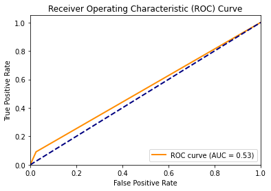
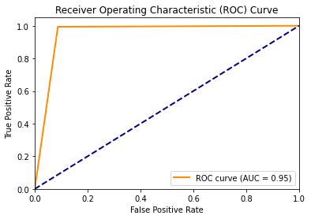
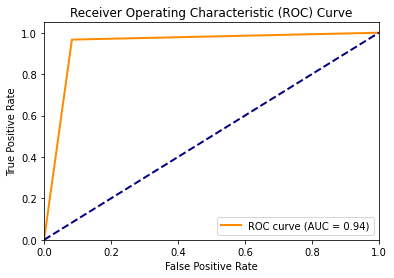

# NBFI Vehicle Loan Default Prediction

This repository contains a machine learning project focused on predicting default on Non-Banking Financial Institution (NBFI) vehicle loans. Predicting loan defaults is crucial for risk assessment and maintaining the financial stability of lending institutions.

## Project Overview

In this project, we leverage various data analysis and machine learning techniques to build a predictive model for identifying potential loan defaults. The main goal is to develop an accurate and reliable model that can assist NBFI institutions in making informed lending decisions and managing risk effectively.

## Dataset

The dataset used in this project is sourced from a Kaggle competition: [NBFI Vehicle Loan Repayment Dataset](https://www.kaggle.com/datasets/meastanmay/nbfi-vehicle-loan-repayment-dataset). It comprises various features related to loan applicants, including income, employment history, credit scores, and more. This data serves as the foundation for our predictive modeling efforts.

## Baseline Performance

To set a baseline for our project, we initially built a predictive model without addressing class imbalance and feature selection. The baseline F1 score for predicting default was approximately 0.13.

- Baseline Model: 0.13

## Model Improvements

We focused on improving model performance by addressing the following key areas:

1. **Class Imbalance**: Dealing with class imbalance using various techniques, such as oversampling and using synthetic minority over sampling SMOTE.

2. **Feature Selection**: Identifying the most relevant features through careful analysis and experimentation. After experimenting, we found that the following combined features yield the highest F1 score for predicting default:

   - Client's employment
   - Educational background
   - Type of loan
   - Home ownership
   - Age of the home
   - Score_Source_3
   - Cleint_City_Rating

   We claim that the default on a loan by a customer can be predicted by these features.

3. **Model Selection**: Exploring different machine learning algorithms, including logistic regression, decision trees, random forests, and neural networks.

4. **Feature Significance Analysis**: To determine the significance of features (both categorical and numerical), we employed logistic regression analysis.

## Results

After implementing these improvements and optimizing our models, we achieved significant performance enhancements. The final models yielded F1 scores of approximately:

- Model 1: 0.96

- Model 2: 0.94

These results demonstrate the effectiveness of our approach in predicting loan defaults.

## Contributions

Contributions, issues, and pull requests are welcome. Feel free to collaborate and improve this project.

## Disclaimer

This project is for educational and research purposes only. The results and predictions should not be used for actual financial decisions without further validation.

